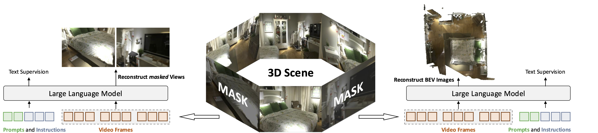

# Ross3D: Reconstructive Visual Instruction Tuning with 3D-Awareness

[[Project Page](https://haochen-wang409.github.io/ross3d/)] [[Model Zoo](https://huggingface.co/HaochenWang/llava-video-qwen2-7b-ross3d)]

[**Ross3D: Reconstructive Visual Instruction Tuning with 3D-Awareness**](https://arxiv.org/pdf/2504.01901) by
[Haochen Wang](https://haochen-wang409.github.io), 
[Yucheng Zhao](https://scholar.google.com/citations?user=QWemjjQAAAAJ&hl=en),
[Tiancai Wang](https://scholar.google.com/citations?user=YI0sRroAAAAJ&hl=en),
[Haoqiang Fan](https://scholar.google.com/citations?hl=en),
[Xiangyu Zhang](https://scholar.google.com/citations?user=yuB-cfoAAAAJ&hl=en), and
[Zhaoxiang Zhang](https://scholar.google.com/citations?user=qxWfV6cAAAAJ).

> **Abstract.** 
> The rapid development of Large Multimodal Models (LMMs) for 2D images and videos has
> spurred efforts to adapt these models for interpreting 3D scenes. 
> However, the absence of large-scale 3D vision-language datasets 
> has posed a significant obstacle. To address this issue, 
> typical approaches focus on injecting 3D awareness into 
> 2D LMMs by designing 3D input-level scene representations. 
> This work provides a new perspective. We introduce 
> reconstructive visual instruction tuning with 3D-awareness (Ross3D), 
> which integrates 3D-aware visual supervision 
> into the training procedure. Specifically, it incorporates 
> cross-view and global-view reconstruction. The former requires 
> reconstructing masked views by aggregating overlapping information
> from other views. The latter aims to aggregate information from all 
> available views to recover Bird’s-Eye-View images, contributing to a comprehensive overview
> of the entire scene. Empirically, ROSS3D achieves state-of-the-art 
> performance across various 3D scene understanding benchmarks. 
> More importantly, our semi-supervised experiments demonstrate significant potential in leveraging
> large amounts of unlabeled 3D vision-only data.



<<<<<<< HEAD
## Release

- [2025/06/09] 🔥 All codes and checkpoints of Ross3D have been released. 
- [2024/04/02] 🔥 **Ross3D** has been released. Checkout the [paper](https://arxiv.org/pdf/2504.01901) for details.


[](https://github.com/tatsu-lab/stanford_alpaca/blob/main/LICENSE)
**Usage and License Notices**: This project utilizes certain datasets and checkpoints that are subject to their respective original licenses. Users must comply with all terms and conditions of these original licenses, including but not limited to the [OpenAI Terms of Use](https://openai.com/policies/terms-of-use) for the dataset and the specific licenses for base language models for checkpoints trained using the dataset (e.g. [Llama community license](https://ai.meta.com/llama/license/) for LLaMA-2 and Vicuna-v1.5). This project does not impose any additional constraints beyond those stipulated in the original licenses. Furthermore, users are reminded to ensure that their use of the dataset and checkpoints is in compliance with all applicable laws and regulations.

## Install

If you are not using Linux, do *NOT* proceed.

1. Clone this repository and navigate to ross3d folder
```bash
git clone https://github.com/Haochen-Wang409/ross3d.git
cd ross3d
```

2. Install Package
```bash
conda create -n ross3d python=3.10 -y
conda activate ross3d
pip install --upgrade pip  # enable PEP 660 support
pip install -e .
pip install flash-attn --no-build-isolation     # install flash attention
```


### Data Preparation

Please follow this [instruction](https://github.com/LaVi-Lab/Video-3D-LLM/blob/main/scripts/3d/preprocessing/README.md) for detail.


## Model Zoo

| Method    | LLM                           | Checkpoint |
|-----------|-------------------------------|---:|
| Ross3D-7B | LLaVA-Video-Qwen2-7B |[HF](https://huggingface.co/HaochenWang/llava-video-qwen2-7b-ross3d) |

## Evaluation

```bash
bash scripts/3d/eval/eval_all.sh HaochenWang/llava-video-qwen2-7b-ross3d <num_frames>
```
We set ```<num_frames>=32``` by default.

## Training

Ross3D was trained on 8 A100 GPUs with 80GB memory. 
To train on fewer GPUs, you can reduce the `per_device_train_batch_size` and increase the `gradient_accumulation_steps` accordingly. 
Always keep the global batch size the same: `per_device_train_batch_size` x `gradient_accumulation_steps` x `num_gpus`.

### Download VAE checkpoints

Our base model takes the VAE from [FLUX.1-dev](https://huggingface.co/black-forest-labs/FLUX.1-dev) as the fine-grained tokenizer.
Downloading the checkpoint from [this URL](https://huggingface.co/black-forest-labs/FLUX.1-dev/resolve/main/vae/) and put them into ```./checkpoints```.

### Download mm_inv_projector

Downloading the pre-trained ```mm_inv_projector``` on 2D data from [this URL](https://huggingface.co/HaochenWang/ross3d-utils) and put the ```mm_inv_projector.bin``` into ```./checkpoints```.

### Instruction Tuning

Training script with DeepSpeed ZeRO-3 can be found in ```scripts/3d/train_ross3d.sh```.

## Citation

If you find Ross useful for your research and applications, please cite using this BibTeX:
```bibtex
@article{wang2025ross3d,
  title={Ross3D: Reconstructive visual instruction tuning with 3D-awareness},
  author={Wang, Haochen and Zhao, Yucheng and Wang, Tiancai and Fan, Haoqiang and Zhang, Xiangyu and Zhang, Zhaoxiang},
  journal={arXiv preprint arXiv:2504.01901},
  year={2025}
}
```

## Acknowledgement

- [Video-3D-LLM](https://github.com/LaVi-Lab/Video-3D-LLM/): the codebase we built upon and the dataset we utilized.
- [ScanNet](https://github.com/ScanNet/ScanNet), [ScanRefer](https://github.com/daveredrum/ScanRefer), [Multi3DRefer](https://github.com/3dlg-hcvc/M3DRef-CLIP), [SQA3D](https://github.com/SilongYong/SQA3D), [ScanQA](https://github.com/ATR-DBI/ScanQA): the datasets we use.
=======
The code will be released soon!
>>>>>>> 5a6a7357c3b629a341e133290ae40292ffb2d538
